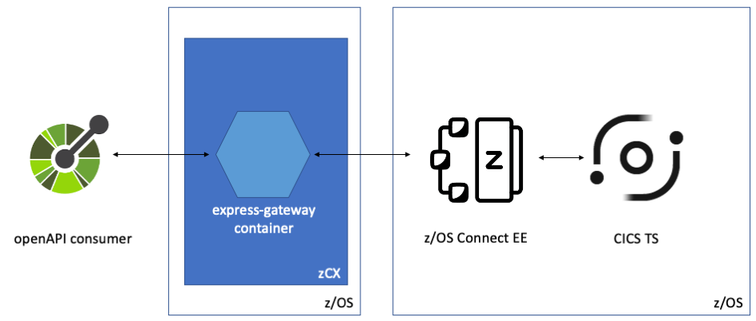
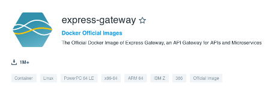
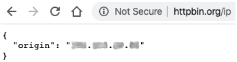
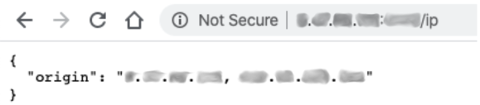
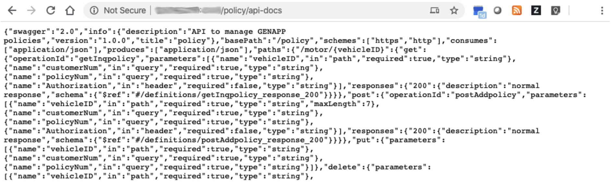
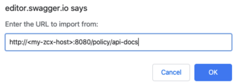
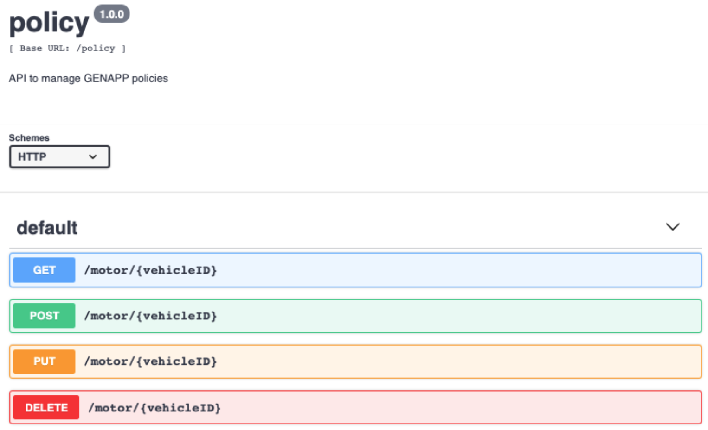

# express-gateway

This material is based upon an experience of following the [“5-minute Getting Started Guide”](https://www.express-gateway.io/getting-started "Getting started with Express Gateway") from the express gateway website together with the IBM z/OS 2.4 feature, [z/OS Connect Extensions](https://www.ibm.com/support/knowledgecenter/SSLTBW_2.4.0/com.ibm.zos.v2r4.izso100/abstract.htm "z/OS Container Extensions documentation") (ZCX). 

## Running express-gateway on ZCX as an API gateway for z/OS Connect EE

The idea was to show how feasible it is to pull down an "off-the-peg" middleware component into ZCX, follow the available tutorial, and then extend this to prove interoperability with an existing z/OS application via z/OS Connect Enterprise Edition. “express-gateway” was selected because it was relevant, and already available for the IBM Z architecture as a Docker Official image with a substantial download statistics, demonstrating its popularity. 



The exploration and results were achieved within 1 working day, over the course of approximately 3-4 hours, and in-between meetings. This seemingly frivolous detail is meant to highlight the simplicity of using container-based offerings, and ZCX, despite having no previous awareness of express-gateway, only limited experience with docker CLI, but extensive experience with the z/OS platform. 

## Contents

- [What is Express Gateway?](#what-is-express-gateway) 
- [Get started](#get-started)
  * [Installation of Express Gateway](#installation-of-express-gateway)
  * [Create a docker volume and why](#create-a-docker-volume-and-why)
- [Iterative testing, debugging and editing the configuration](#iterative-testing-debugging-and-editing-the-configuration)
  * [Start Express Gateway](#start-express-gateway)
  * [Basic Express Gateway configuration](#basic-express-gateway-configuration)
  * [First issues encountered with Express Gateway under ZCX](#first-issues-encountered-with-express-gateway-under-zcx)
- [Adding a z/OS Connect Enterprise Edition API](#adding-a-zos-connect-enterprise-edition-api)
  * [Express Gateway debug log with z/OS Connect config](#express-gateway-debug-log-with-zos-connect-config)
  * [Testing Express Gateway with z/OS Connect config](#testing-express-gateway-with-zos-connect-config)
- [Securing an API pipeline with API keys](#securing-an-api-pipeline-with-api-keys)
- [Express Gateway resource usage and scalability test](#express-gateway-resource-usage-and-scalability-test)
  * [Workload generation using Apache Benchmark](#workload-generation-using-apache-benchmark)

## What is Express Gateway?

From: https://www.express-gateway.io/about/#what-exactly-is-express-gateway

> Express Gateway is a bunch of components which declaratively build around Express to meet the API Gateway use case. Express Gateway’s power is harnessed the rich ecosystem around Express middleware.

From https://hub.docker.com/_/express-gateway

> Express Gateway is an API Gateway that sits at the heart of any microservices architecture, regardless of what language or platform you're using. Express Gateway secures your microservices and exposes them through APIs using Node.js, ExpressJS and Express middleware. Developing microservices, orchestrating and managing them now can be done insanely fast all on one seamless platform without having to introduce additional infrastructure.

'express-gateway' is the name of the container image that is freely available from docker hub, and supports the IBM Z architecture:



## Get started

Start off by logging into the ZCX appliance using your 'ssh' client of choice:

```
>ssh rcjones@<my-zcx-host> -p <zcx-port>

Welcome to the IBM z/OS Container Extensions (IBM zCX) shell that provides access to Docker commands.
For more information on how to use this shell to execute Docker commands refer to IBM
Last login: Tue Feb 18 10:24:34 2020 from <my-client-IP>
```

### Installation of Express Gateway

Since this exercise uses the containerised version of Express Gateway, it skips the first part of the tutorial on installation. Instead, after logging into docker hub using the docker login command, follow the usual process of using the 'docker pull' command to obtain the 'express-gateway' image:

```
>docker pull express-gateway
Using default tag: latest
latest: Pulling from library/express-gateway
176bad61a3a4: Pull complete 
c3d69bfd27db: Pull complete 
2c3acf30eeed: Pull complete 
17c0ffc5c96f: Pull complete 
0b46d6548862: Pull complete 
636c34f4e42c: Pull complete 
Digest: sha256:a1bf18d2b7534cf47dee6c096cfab9e5119c0e9a5864223771ad32ab6eeaf506
Status: Downloaded newer image for express-gateway:latest
```

### Create a docker volume and why
The first issue to surace when trying to follow the express-gateway tutorial under ZCX, rather than a regular docker runtime, was related to the mounting of persistent storage on the filesystem. This is used to store configuration and miscellaneous files required for express-gateway to run, and to persist between runs in isolation from the express-gateway docker image. This pattern suits the purposes of this investigation, as iterative changes are made to the express gateway configuration. 

After creating a local directory datadir in my “sandbox” for express-gateway, the following 'docker run' command is used, based upon the example in the tutorial.

```
>docker run -d --name express-gateway --link eg-database:eg-database -v ~/docker-sandbox/express-gateway/datadir:/var/lib/eg -p 8080:8080 -p 9876:9876 express-gateway
```

Unfortunately, this resulted in a hard error:

```
docker: Error response from daemon: authorization denied by plugin zcxauthplugin: Request to bind mount the path "/home/rcjones/docker-sandbox/express-gateway/datadir" with rw mode is disabled for Docker running on IBM zCX appliance instance.
See 'docker run --help'.
```

After reading through various general guidance on docker and mounting of volumes, it appears that the preferred option is to use docker volumes, rather than binding explicitly filesystem locations into the container filesystem. So, the 'docker volume create' command is used to create the volume 'exgvol':

```
>docker volume create exgvol
```

The 'docker volume create' command completes without any confirmation of success. Check the result using the docker volume command:

```
>docker volume ls
DRIVER              VOLUME NAME
local               AZD_HOME_VOLUME
local               AZD_MGMT_VOLUME
local               AZD_SHARED_VOLUME
local               cf6f081a31358caac9c0c541580a5d8d0f7d93e5acc7b16b3537920cec29e3be
local               exgvol
```

Ok that was easy. The 'docker run' parameters to start express-gateway need to be tweaked slightly to specify the volume to mount ('-v exgvol:/var/lib/eg') rather than the file system location, and to make the mounted volume read/write ('rw'):

```
>docker run -d --name express-gateway -v exgvol:/var/lib/eg:rw -p 8080:8080 -p 9876:9876 express-gateway
```

## Iterative testing, debugging and editing the configuration 

At this point it should be possible to start express-gateway under ZCX, review the logs using the 'docker logs' command, and start the configuration process by editing the express-gateway configuration file, '/var/lib/eg/gateway.config.yml'. 

```
>docker logs 63167e4397d1
gateway.config.yml file not found in / - copying now...
system.config.yml file not found in / - copying now...
users.json file not found in / - copying now...
applications.json file not found in / - copying now...
credentials.json file not found in / - copying now...
Warning: connect.session() MemoryStore is not
designed for a production environment, as it will leak
memory, and will not scale past a single process.
2020-02-18T10:51:02.303Z [EG:gateway] info: gateway http server listening on :::8080
2020-02-18T10:51:02.304Z [EG:admin] info: admin http server listening on 127.0.0.1:9876
```

However, this can all fall down due to a simple syntax error in the YAML configuration file! Thanks to express-gateway’s automatic reloading of the configuration, this caused the server to fail and the container stopped, taking the shell session (being used to edit the configuration file) with it: 

```
>docker logs 7d8f544e23f100ba337e3343f086c4688029079438db8016f5501e7d82b393e0
2020-02-18T12:15:57.255Z [EG:config] error: data.pipelines['example-pipeline'].policies should be array
/usr/local/share/.config/yarn/global/node_modules/express-gateway/lib/config/index.js:15
  throw err;
  ^
Error: data.pipelines['example-pipeline'].policies should be array
    at Config.loadConfig (/usr/local/share/.config/yarn/global/node_modules/express-gateway/lib/config/config.js:55:13)
    at forEach.type (/usr/local/share/.config/yarn/global/node_modules/express-gateway/lib/config/index.js:12:48)
    at Array.forEach (<anonymous>)
    at Object.<anonymous> (/usr/local/share/.config/yarn/global/node_modules/express-gateway/lib/config/index.js:12:25)
    at Module._compile (internal/modules/cjs/loader.js:778:30)
    at Object.Module._extensions..js (internal/modules/cjs/loader.js:789:10)
    at Module.load (internal/modules/cjs/loader.js:653:32)
    at tryModuleLoad (internal/modules/cjs/loader.js:593:12)
    at Function.Module._load (internal/modules/cjs/loader.js:585:3)
    at Module.require (internal/modules/cjs/loader.js:692:17)
```

An alternative approach is required to work on the configuration file independent of the express-gateway container. Since the express-gateway image iteslf is based upon 'busybox', this was used for the minimal requirement of editing a text-based configuration file. _In retrospeect, a better choice might have been Ubuntu, as busybox only offers ‘sh’ and ‘vi’ as minimal tooling to get by with!_

```
>docker pull busybox
Using default tag: latest
latest: Pulling from library/busybox
6dc7af96dfc8: Pull complete 
Digest: sha256:6915be4043561d64e0ab0f8f098dc2ac48e077fe23f488ac24b665166898115a
Status: Downloaded newer image for busybox:latest
```

Start the busybox container, attaching the same volume used by the express-gateway container: 

```
>docker run -it --name rob-busybox -v exgvol:/var/lib/eg:rw --rm busybox
```

### Re-establishing a Busybox shell session

Dipping in and out of this work meant the SSH session to ZCX would timeout, meaning that the shell resulting from the above docker run command was lost. Start a new shell using the docker exec command shown below. 

**Note:** busybox does not have bash shell, so specify sh as the shell to run:

```
>docker exec -it <container id> sh
```

### Start Express Gateway

```
>docker run -d --name express-gateway -v exgvol:/var/lib/eg:rw -p 4080:8080 -p 5876:9876 express-gateway
```

To start express-gateway with debug logging active, specify the environment variable “LOG_LEVEL” with the value “debug”:

```
>docker run -d -e LOG_LEVEL=debug --name express-gateway -v exgvol:/var/lib/eg:rw -p 4080:8080 -p 5876:9876 express-gateway
```

### Basic Express Gateway configuration
Here we begin to follow the express-gateway tutorial, “5-minute Getting Started Guide”, Part 1 “Specify a microservice and expose as an API”.

The basic configuration provided in the tutorial defines an API (called “api”) with a single path value “/ip”, which uses a public REST API from httpbin.org to simply return a JSON payload containing the callers’ IP address. You can try this from a browser, or CLI commands such as curl or wget:



The tutorial walks you toward the creation of a gateway configuration file, '/var/lib/eg/gateway.config.yml', although it doesn’t provide a “complete” working version. The express gateway configuration file is stored under path '/var/lib/eg' as file 'gateway.config.yml'. The following initial example adds a definition for an API called 'api' under the path '/ip', and a service endpoint for the external 'http.org' public service '/ip', which reports back some simple information about the originating caller. Finally, the pipelines section links the 'api' endpoint with the service endpoint.   

```
http:
    port: 8080
      
admin:      
    port: 9876   
    host: localhost

apiEndpoints:
    api:
        host: localhost
        paths: /ip

serviceEndpoints:                                                                                                                                                        
    httpbin:
        url: 'https://httpbin.org'

policies:
    - basic-auth
    - cors
    - expression
    - key-auth
    - log          
    - oauth2
    - proxy
    - rate-limit

pipelines:
    default:
        apiEndpoints:
            - api          
        policies:                                                                  
            - {proxy: [{action: {serviceEndpoint: httpbin, changeOrigin: true}}]}
```

### First issues encountered with Express Gateway under ZCX

Testing the basic express-gateway configuration for the httpbin service proved straight forward when using a local workstation docker. However, running under ZCX consistently resulted in the “Cannot GET /ip” error:


After turning on debug, eliminating the easily made YAML syntax errors (when using vi), the first issue was that the samples tell you to specify “localhost” in the host value. When running ZCX remotely, then requests originating via the external TCP/IP adapter host address fail to match the pipeline definition. The debug log output shows:

```
2020-02-18T16:20:10.271Z [EG:gateway] debug: No pipeline matched, returning 404.
```

To correct this, change host to ‘*’. The debug log now shows a successful match:

```
2020-02-18T16:27:01.293Z [EG:policy] debug: proxying to http://httpbin.org, GET /ip
```

However, the output still didn’t work. It seems that the ZCX server TLS configuration causes HTTPS handshake failure when talking to https://httpbin.org. This is shown by using curl from the command line:

```
>curl -G https://httpbin.org/ip
curl: (77) error setting certificate verify locations:
  CAfile: /etc/ssl/certs/ca-certificates.crt
  CApath: /etc/ssl/certs
```

```
>curl -G http://httpbin.org/ip
{
  "origin": "<my-zcx-host>"
}
```

_Other https endpoint appear to return data normally – so it seems we just hit a glitch here with this particular combination of certificates._

Changing the serviceEndpoint definition for `httpbin` to http://httpbin.org saved the day!

### Modified Express Gateway configuration for ZCX
Here is the updated gateway configuration file for the httpbin service, adapted for testing in ZCX:
```
http:
    port: 8080

admin:
    port: 9876
    host: localhost

apiEndpoints:
    api:
        host: ‘*’
        paths: /ip

serviceEndpoints:
    httpbin: 
        url: 'http://httpbin.org'

policies:
    - basic-auth          
    - cors
    - expression
    - key-auth
    - log
    - oauth2
    - proxy
    - rate-limit

pipelines:
    default:
        apiEndpoints:
            - api
        policies:
            - {proxy: [{action: {serviceEndpoint: httpbin, changeOrigin: true}}]}
```
This example gateway configuration file is available [here](examples/httpbin/gateway.config.yml).



## Adding a z/OS Connect Enterprise Edition API

Following the pattern established from the 'httpbin' example, a second pipeline and associated definitions is added in the following gateway configuration file, allowing express gateway to act as a proxy for the 'policy' API. The 'policy' API is provider by a z/OS Connect EE server listeing on 'myzos.mycorp.com' port 10220, under base path 'policy'. **Note:** This is not to be confused with the 'policies' definitions of express gateway!  

Here is the updated gateway configuration file, adding the z/OS Connect EE 'policy' API:

```
http:
    port: 8080
admin:
    port: 9876
    host: localhost
apiEndpoints:
    api:
        host: '*'
        paths: /ip
    policy_api:
        host: '*'
        paths: '/policy/*'

serviceEndpoints:
    httpbin:
        url: 'http://httpbin.org'
    zceepolicy:
        url: 'http://myzos.mycorp.com:10220'
policies:
    - basic-auth
    - cors
    - expression
    - key-auth
    - log
    - oauth2
    - proxy
    - rate-limit
pipelines:
    default:
        apiEndpoints:
            - api
        policies:
            - {proxy: [{action: {serviceEndpoint: httpbin, changeOrigin: true}}]}
    zosconnect:                                                                     
        apiEndpoints:                                                            
            - policy_api                                                                
        policies:                                                                
            - {proxy: [{action: {serviceEndpoint: zceepolicy, changeOrigin: true}}]}   
```
This example gateway configuration file is available [here](examples/zosconnect/gateway.config.yml).

### Express Gateway debug log with z/OS Connect config
```
2020-02-18T17:25:11.266Z [EG:config] info: change event on /var/lib/eg/gateway.config.yml file. Reloading gateway config file
2020-02-18T17:25:11.267Z [EG:config] debug: ConfigPath: /var/lib/eg/gateway.config.yml
2020-02-18T17:25:11.267Z [EG:plugins] debug: Loading plugins. Plugin engine version: 1.2.0
Warning: connect.session() MemoryStore is not
designed for a production environment, as it will leak
memory, and will not scale past a single process.
2020-02-18T17:25:11.269Z [EG:gateway] verbose: processing pipeline default
2020-02-18T17:25:11.270Z [EG:gateway] verbose: processing pipeline zosconnect
2020-02-18T17:25:11.270Z [EG:gateway] debug: loading apiEndpoints {"api":{"host":"*","paths":"/get"},"policy_api":{"host":"*","paths":"/policy/*"}}
2020-02-18T17:25:11.270Z [EG:gateway] debug: processing host: *, isRegex: false
2020-02-18T17:25:11.270Z [EG:gateway] debug: adding route to host: *, {"apiEndpointName":"api","host":"*","paths":"/get"}
2020-02-18T17:25:11.270Z [EG:gateway] debug: processing host: *, isRegex: false
2020-02-18T17:25:11.270Z [EG:gateway] debug: adding route to host: *, {"apiEndpointName":"policy_api","host":"*","paths":"/policy/*"}
2020-02-18T17:25:11.271Z [EG:gateway] debug: processing vhost * [{"apiEndpointName":"api","host":"*","paths":"/get"},{"apiEndpointName":"policy_api","host":"*","paths":"/policy/*"}]
2020-02-18T17:25:11.271Z [EG:gateway] debug: mounting routes for apiEndpointName api, mount /get
2020-02-18T17:25:11.271Z [EG:gateway] debug: executing pipeline for api api, mounted at /get
2020-02-18T17:25:11.271Z [EG:gateway] debug: no methods specified. handle all mode.
2020-02-18T17:25:11.271Z [EG:gateway] debug: mounting routes for apiEndpointName policy_api, mount /policy/*
2020-02-18T17:25:11.271Z [EG:gateway] debug: executing pipeline for api policy_api, mounted at /policy/*
2020-02-18T17:25:11.271Z [EG:gateway] debug: no methods specified. handle all mode.
2020-02-18T17:25:11.272Z [EG:gateway] info: hot-reload config completed
2020-02-18T17:26:07.153Z [EG:policy] debug: proxying to http://myzos.mycorp.com:10220/, GET /policy/api-docs
```
### Testing Express Gateway with z/OS Connect config

To see a “raw” response, point your browser at the express-gateway on ZCX, and request the OpenAPI description of the policy API from z/OS Connect EE:

`http://<my-zcx-host>:4080/policy/api-docs`

Success!



For a more polished experience, try importing the proxied z/OS Connect EE API docs for the policy API to the swagger.io editor:



The swagger.io editor allows for simple testing of the 'policy' API, through the express gateway running in ZCX:



## Securing an API pipeline with API keys

The express-gateway offers a command line interface (CLI) called “eg” that allows the definition of users in an internal registry, and the creation of API key/secret pairs for each user. By simply adding the “key-auth” policy to the API pipeline configuration policy, requests to the API path are rejected unless accompanied by a valid key/secret pair.

To access the “eg” CLI requires a shell to be started within the express-gateway container: 

```
>docker exec -it 5ce8ad762532 sh
```

Continuing to follow the steps in the tutorial, Part 2 “Define API consumer”, and Part 3 “Secure the API with Key Authorization”:

```
>eg users create
2020-02-20T11:17:46.840Z [EG:config] verbose: Registered schema for users model.
2020-02-20T11:17:46.842Z [EG:config] verbose: Registered schema for credentials model.
2020-02-20T11:17:46.843Z [EG:config] verbose: Registered schema for applications model.
2020-02-20T11:17:46.850Z [EG:config] debug: ConfigPath: /var/lib/eg/system.config.yml
2020-02-20T11:17:46.876Z [EG:config] debug: ConfigPath: /var/lib/eg/gateway.config.yml
Configuring yargs through package.json is deprecated and will be removed in a future major release, please use the JS API instead.
Configuring yargs through package.json is deprecated and will be removed in a future major release, please use the JS API instead.
Configuring yargs through package.json is deprecated and will be removed in a future major release, please use the JS API instead.
? Enter firstname [required]: Bob
? Enter lastname [required]: Smith
? Enter username [required]: bob
? Enter email: bob@mycorp.com
? Enter redirectUri: undefined
✔ Created d94c669e-eb07-4651-8ecc-e82e08d393a3
{
  "isActive": true,
  "username": "bob",
  "id": "d94c669e-eb07-4651-8ecc-e82e08d393a3",
  "firstname": "Bob",
  "lastname": "Smith",
  "email": "bob@mycorp.com",
  "createdAt": "Thu Feb 20 2020 11:18:19 GMT+0000 (Coordinated Universal Time)",
  "updatedAt": "Thu Feb 20 2020 11:18:19 GMT+0000 (Coordinated Universal Time)"
}
```

Modify the pipeline policy for the policy API to add the 'key-auth' attribute, to require an API key:

```
pipelines:
    default:
        apiEndpoints:
            - api
        policies:
            - {proxy: [{action: {serviceEndpoint: httpbin, changeOrigin: true}}]}
    zosconnect:                                                                     
        apiEndpoints:                                                            
            - policy_api                                                                
        policies:                                                                
            - key-auth:   
            - {proxy: [{action: {serviceEndpoint: zceepolicy, changeOrigin: true}}]}   
```

Show that the API is now secure, by issuing a GET request without an API key/secrete pair:

```
>curl -G http://<my-zcx-host>:4080/policy/api-docs

Unauthorized
```

But when including the API key and secret pair via an Authorization header:

```
>curl -G -H "Authorization: apiKey 5w2FAr1yNZdqq3agNcdnjE:61Af99pZxhlMWJlxtQP6uY"
 http://<my-zcx-host>:4080/policy/api-docs

{"swagger":"2.0","info":{"description":"API to manage GENAPP policies","version":"1.0.0","title":"policy"},"basePath":"/policy","schemes":["https","http"],"consumes":["application/json"],"produces":["application/json"],"paths":{"/motor/{vehicleID}":{"get":{"operationId":"getInqpolicy","parameters":[{"name":"vehicleID","in":"path","required":true,"type":"string"} 

(output truncated)
```

## Express Gateway resource usage and scalability test
One of the inevitable questions that is asked about off-the-peg open source solutions, such as express-gateway, and of new technologies such as ZCX, is “does it scale?”. Here, a very crude workload test attempts to show how a single container instance of express-gateway performs under a homogeneous workload. 

In this test, the workload driver is a laptop on my desk in Hursley (UK), express-gateway is running on a ZCX appliance in Poughkeepsie (USA), and z/OS Connect EE is running in Hursley (UK), and so latency is relatively high! However, the results show a relatively small increase in virtual memory usage within the express-gateway container, and a not inconsiderable request rate when simulating up-to 200 concurrent clients. 

Using the top command running within the express-gateway container, an unloaded express-gateway process appears to consume approximately 300MB of virtual storage:


The Apache Benchmark tool makes it very easy to generate a homogeneous HTTP-based workload at considerable scale. See the appendix for the full output.

```
ab -c 200 -n 100000 -m GET -H "Authorization: apiKey 5w2FAr1yNZdqq3agNcdnjE:61Af99pZxhlMWJlxtQP6uY" 
 -k http://<my-zcx-host>:4080/policy/api-docs
```

Under load 100 concurrent clients at approximately 600 requests per second, this rose to 314MB:


Under load 200 concurrent clients at approximately 1140 requests per second , this rose to 328MB :


Observing the z/OS Connect EE address space at the backend, CPU consumption rose from 0% to 15% under the 1140 requests per second load (just to show the traffic was arriving to the target service endpoint). 

Driving z/OS Connect EE at 15% CPU


### Workload generation using Apache Benchmark

The following output shows use of Apache Benchmark ('ab') to generate a workload of 200 concurrent clients, sending 100,000 http GET requests to the z/OS Connect EE 'policy' API, via the express gateway running in ZCX. **Note:** The workload client and z/OS Connect EE server, were roundtripping with ZCX between continents, so the latency is not representative of a typical configuration!  

```
>ab -c 200 -n 100000 -m GET -H "Authorization: apiKey 5w2FAr1yNZdqq3agNcdnjE:61Af99pZxhlMWJlxtQP6uY" 
 -k http://<my-zcx-host>:4080/policy/api-docs

This is ApacheBench, Version 2.3 <$Revision: 1843412 $>
Copyright 1996 Adam Twiss, Zeus Technology Ltd, http://www.zeustech.net/
Licensed to The Apache Software Foundation, http://www.apache.org/

Benchmarking <my-zcx-host> (be patient)
Completed 10000 requests
Completed 20000 requests
Completed 30000 requests
Completed 40000 requests
Completed 50000 requests
Completed 60000 requests
Completed 70000 requests
Completed 80000 requests
Completed 90000 requests
Completed 100000 requests
Finished 100000 requests


Server Software:        
Server Hostname:        <my-zcx-host>
Server Port:            4080

Document Path:          /policy/api-docs
Document Length:        3967 bytes

Concurrency Level:      200
Time taken for tests:   87.455 seconds
Complete requests:      100000
Failed requests:        0
Keep-Alive requests:    100000
Total transferred:      415300000 bytes
HTML transferred:       396700000 bytes
Requests per second:    1143.45 [#/sec] (mean)
Time per request:       174.910 [ms] (mean)
Time per request:       0.875 [ms] (mean, across all concurrent requests)
Transfer rate:          4637.44 [Kbytes/sec] received

Connection Times (ms)
              min  mean[+/-sd] median   max
Connect:        0    0   3.6      0      84
Processing:   154  174  37.3    166     828
Waiting:      154  171  31.5    165     828
Total:        154  174  38.6    166     828

Percentage of the requests served within a certain time (ms)
  50%    166
  66%    170
  75%    173
  80%    176
  90%    186
  95%    215
  98%    266
  99%    334
 100%    828 (longest request)
```
