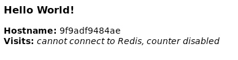

## Docker for the Systems Crowd
A lot has been made of Docker as a foundational technology and framework for
open source application runtime environments over the last several years.  This
explanation is intended for system architects, administrators, and operators
who need to know why Docker is important, and how to it can fit into enterprise
system deployments.

Docker is a popular interface to a set of Linux infrastructure generally referred
to as _**Linux Containers**_
[https://linuxcontainers.org/](https://linuxcontainers.org/).  This is why
Docker was first implemented on Linux, and only recently has become available
for platforms like IBM z/OS, Microsoft Windows and Apple MacOS.

Docker has succeeded because it provides the command line and application
programming interfaces to Linux containers that make it relatively easy for
developers to use when packaging their applications.  It allows them to
"containerize" their applications to make them more modular, and to share code
between multiple applications on the same Linux system.  In this way, it brings
the concept of code reuse from the code development phase to the code deployment
environment.

Containers provide application isolation on a single system image, along with a
means for developers to make use of system resource abstractions for CPU, memory,
network, and disks (file systems).  This is for applications that often run
best together on the same system instance.  They use the system abstractions
of Linux containers to define how other applications can interface with them,
and to reasonably quantify and limit the system resources the application will use.
These application resource requirement descriptions are estimates that can have
a significant margin of error, but they do force the developer to think about
the runtime characteristics of what they are creating.

Containers fit naturally with the devOPs model of application development,
where the developer has a certain level of control over how their application is
deployed.  It requires the developer to think about how their application will
use resources on a shared system that runs other workloads.  This is a big step
forward from the days when developers assumed that a system would be dedicated
to their particular workload.

As the development community has adopted the container-based model for
workload deployment that includes estimates of required system resources, they
have enabled the rise of the cloud model.  Workloads can be managed based on
resource usage descriptors to create workload-balanced configurations,
enhance availability and improve deployment efficiency for applications with
specific hardware requirements.  The orchestration of workloads in a cloud
deployment makes containers a key piece of modern computing infrastructure.   


## Using Docker
The focus of this explanation is to give a z/OS system administrator a starting
point for using Docker in an IBM z/OS Container Extensions (zCX) appliance.  It
assumes that the appliance has been provisioned and allocated enough resources
to accommodate a moderate workload.

### Images, Layers and Containers
First, some terminology definition and review.  The binary content to run using
docker is an _image_, while an instance of that running binary is a _container_.
It's analogous to the relationship between a load module and a running program.
Sometimes these terms are used interchangeably, but the distinction is important
for Docker's command line interface (CLI).

An _intermediate image_ is often referred to as a _layer_.  Docker images
are aggregate entities, made up of one or more layers that can be shared between
images.  For instance, the Docker community has created an image for
the Python language that is widely available, and used by a large number of
Docker images.  Developers simply list it as a dependency in their build recipe
(Dockerfile) for any application that they want to create.  When they build that
application, Docker notes the dependency, and will request the Python image from
a repository of existing images called a _registry_.  Once pulled into the local
cache, Docker will know to use this Python image again if another build request
references it.

### Image Registries
Image registries are servers that provide images to users or applications that
need them.  Sometimes these requests are made during docker image development,
and sometimes they're requested when starting a particular docker workload.
Registries can be _secure_ (requiring user login) or _insecure_ (no login
required) - similar to ftp and anonymous ftp.  Requests are made for images
using the docker _pull_ action, and images can be published to the registry
via docker _push_.

Images can be pulled from the default DockerHub (https://index.docker.io/v1/) or
from private registries hosted within an enterprise.  Docker can be configured to
reference these registries in a specific search order.  Images can be versioned
using a docker mechanism called _tagging_.

Registries are a mechanism for developers to share work and build their
community.  Docker would not be a success today without DockerHub.  Registries
provide a repository, or channel of software that can be updated by both
authorized users/developers, and system administrators, and this makes registries
different from conventional z/OS software management mechanisms.  It allows these
channels to be key pieces of collaboration infrastructure.

### Trusted Channels
DevOPs-based open source software installation and configuration follows the
community hub model mentioned above, and assumes connectivity between a given
system and the internet.  Users in this space accept that internet access will
be through a  firewall, but they presume that sites like DockerHub, Anaconda, or
the Node Package Manager hub are visible.

This contrasts with production z/OS environments, where systems are usually
"air gapped", with no internet access.  The Z-based enterprise environment is
only allowed access to a small group of trusted vendors, like IBM.  

When open source code is wrapped in a product or services offering, and shipped
in a PTF, it follows the conventional z/OS installation and configuration process
established by SMP/E.  This is not the community hub approach that the open
source community expects, and it can generate friction between users and
administrators.

This disconnect between the two operational environments is well understood, and
IBM is working with partners on a solution that reconciles these differences.
For the purposes of this guide, we will assume that DockerHub is available, and
that the reader is working in a proof-of-concept environment running an IBM
zCX appliance.


## Hello World
Many of the steps here are derived from the
_**[Get started with Docker](https://docs.docker.com/get-started/)**_ tutorial.
This documentation is good at describing what docker does, and how to use docker
interfaces.  It's a good reference for details not covered here.

This assignment is built around a web-based python application that makes use of
the _flask_ framework to serve web content, and a _Redis_ in-memory database.
This assignment won't actually make use of the database, but it's part of
the application that illustrates how Redis is used in a more advanced
configuration.

### Build and Run a Docker Application
The steps below are performed on an IBM zCX appliance.  You should ssh into your
appliance at port 8022 before proceeding.

### Build a Simple Image
First, we have to build a docker image for the application.  Later, we will
deploy this image in different configurations to illustrate how Docker works.

There are 3 primary source parts:

- _**requirements.txt**_ - this is a list of packages referenced by the application
that is passed on to the the python package manager (_pip_) so that it can fetch
those packages for the application to use.
- _**app.py**_ - the application.  This is what will run in the Docker container.
- _**Dockerfile**_ - the recipe that Docker uses to build the image.

#### Create the Source
- Create a local directory for this assignment (fh) and cd into it.
- Create each of the files below, and paste the text provided into them.

_**Note:**_ If you created these files off platform and are transferring to the
appliance:
   - On your appliance, create the same directory, and transfer the source files
     to it.  _Some transfer mechanisms like ftp or sftp can make assumptions
     about text encoding that aren't appropriate for the source platform.  This
     can result in the transferred files getting damaged.  Here is an example of
     an scp command that generally works well:_

     ```
     scp -P 8022 ./* <userid>@<appliance_IP>:/home/<userid>/fh
     ```

#### requirements.txt
This is a simple list of packages that the Python application below will be
importing and using.

```
Flask
Redis
```

#### app.py
This is the application that runs in the docker container.  Make sure to keep
the indentation consistent as you cut/paste this text so Python doesn't complain.

```
from flask import Flask
from redis import Redis, RedisError
import os
import socket

# Connect to Redis
redis = Redis(host="redis", db=0, socket_connect_timeout=2, socket_timeout=2)

app = Flask(__name__)

@app.route("/")
def hello():
    try:
        visits = redis.incr("counter")
    except RedisError:
        visits = "<i>cannot connect to Redis, counter disabled</i>"

    html = "<h3>Hello {name}!</h3>" \
           "<b>Hostname:</b> {hostname}<br/>" \
           "<b>Visits:</b> {visits}"
    return html.format(name=os.getenv("NAME", "world"),
                       hostname=socket.gethostname(),
                       visits=visits)

if __name__ == "__main__":
    app.run(host='0.0.0.0', port=80)
```

#### Dockerfile
This is the recipe that Docker uses to build an image.

```
# Use an official Python runtime as a parent image
FROM python:3.7-slim

# Set the working directory to /app
WORKDIR /app

# Copy the current directory contents into the container at /app
COPY . /app

# Install any needed packages specified in requirements.txt
RUN pip install --trusted-host pypi.python.org -r requirements.txt

# Make port 80 available to the world outside this container
EXPOSE 80

# Define environment variable
ENV NAME World

# Run app.py when the container launches
CMD ["python", "app.py"]
```

#### Build and Tag the Image
Now we will build the image, and "tag" it for use with other docker operations.
Image tagging can be a little confusing at first.  We have created
_**[a Docker tagging explanation](./tags_regs_userid.md)**_ that describes how
tagging works in more detail.

One thing to highlight is that the image build process will use the **pip**
package manager to obtain the _flask_ and _redis_ Python packages from the
_**[pypi.org](https://pypi.org/)**_ portal.  This portal provides an index to
a large set of open source Python packages, as well as the installation
repository/hub.

Also note that the _flask_ web server will be listening to the default port 80,
which will be exposed by the docker container that is started (run) from this
image.  We will see how this gets re-mapped when the container is deployed so
that multiple running containers avoid port collisions.

Here is the build command:

```
docker build --tag=fh/friendlyhello:v1 .
```

Don't forget the dot ('.') at the end to indicate that the build is to take place
in the current working directory.  This is the output from the build command:

```
Sending build context to Docker daemon  6.144kB
Step 1/7 : FROM python:3.7-slim
3.7-slim: Pulling from library/python
7ffdabbd82dd: Pull complete
a3c8bb827a14: Pull complete
5725c0932c1b: Pull complete
57ec5e6c2dd7: Pull complete
c28f4ea63d4e: Pull complete
Digest: sha256:baf4188f0b50c6383fedd55cdb79f511bfabee23068dcf26f209426this
 is part of what can be confusing about docker tagging.  f4bf540ab
Status: Downloaded newer image for python:3.7-slim
 ---> 54435c45ac87
Step 2/7 : WORKDIR /app
 ---> Running in 8324a4865417
Removing intermediate container 8324a4865417
 ---> 383711f544e2
Step 3/7 : COPY . /app
 ---> 68092bd3249a
Step 4/7 : RUN pip install --trusted-host pypi.python.org -r requirements.txt
 ---> Running in bbbc541f4944
Collecting Flask (from -r requirements.txt (line 1))
  Downloading https://files.pythonhosted.org/packages/9a/74/670ae9737d14114753b8c8fdf2e8bd212a05d3b361ab15b44937dfd40985/Flask-1.0.3-py2.py3-none-any.whl (92kB)
Collecting Redis (from -r requirements.txt (line 2))
  Downloading https://files.pythonhosted.org/packages/ac/a7/cff10cc5f1180834a3ed564d148fb4329c989cbb1f2e196fc9a10fa07072/redis-3.2.1-py2.py3-none-any.whl (65kB)
Collecting itsdangerous>=0.24 (from Flask->-r requirements.txt (line 1))
  Downloading https://files.pythonhosted.org/packages/76/ae/44b03b253d6fade317f32c24d100b3b35c2239807046a4c953c7b89fa49e/itsdangerous-1.1.0-py2.py3-none-any.whl
Collecting click>=5.1 (from Flask->-r requirements.txt (line 1))
  Downloading https://files.pythonhosted.org/packages/fa/37/45185cb5abbc30d7257104c434fe0b07e5a195a6847506c074527aa599ec/Click-7.0-py2.py3-none-any.whl (81kB)
Collecting Werkzeug>=0.14 (from Flask->-r requirements.txt (line 1))
  Downloading https://files.pythonhosted.org/packages/9f/57/92a497e38161ce40606c27a86759c6b92dd34fcdb33f64171ec559257c02/Werkzeug-0.15.4-py2.py3-none-any.whl (327kB)
Collecting Jinja2>=2.10 (from Flask->-r requirements.txt (line 1))
  Downloading https://files.pythonhosted.org/packages/1d/e7/fd8b501e7a6dfe492a433deb7b9d833d39ca74916fa8bc63dd1a4947a671/Jinja2-2.10.1-py2.py3-none-any.whl (124kB)
Collecting MarkupSafe>=0.23 (from Jinja2>=2.10->Flask->-r requirements.txt (line 1))
  Downloading https://files.pythonhosted.org/packages/b9/2e/64db92e53b86efccfaea71321f597fa2e1b2bd3853d8ce658568f7a13094/MarkupSafe-1.1.1.tar.gz
Building wheels for collected packages: MarkupSafe
  Building wheel for MarkupSafe (setup.py): started
  Building wheel for MarkupSafe (setup.py): finished with status 'done'
  Stored in directory: /root/.cache/pip/wheels/f2/aa/04/0edf07a1b8a5f5f1aed7580fffb69ce8972edc16a505916a77
Successfully built MarkupSafe
Installing collected packages: itsdangerous, click, Werkzeug, MarkupSafe, Jinja2, Flask, Redisthis
 is part of what can be confusing about docker tagging.  
Successfully installed Flask-1.0.3 Jinja2-2.10.1 MarkupSafe-1.1.1 Redis-3.2.1 Werkzeug-0.15.4 click-7.0 itsdangerous-1.1.0
Removing intermediate container bbbc541f4944
 ---> 3d24d3b7b955
Step 5/7 : EXPOSE 80
 ---> Running in 884fc19fde01
Removing intermediate container 884fc19fde01
 ---> f44296e22b40
Step 6/7 : ENV NAME World
 ---> Running in 2cc2b0273e69
Removing intermediate container 2cc2b0273e69
 ---> 34a7b8b0ba25
Step 7/7 : CMD ["python", "app.py"]
 ---> Running in 638b864da651
Removing intermediate container 638b864da651
 ---> 703a5868557a
Successfully built 703a5868557a
Successfully tagged fh/friendlyhello:v1
```

Now we have a new image:

```
~/fh$ docker images
REPOSITORY              TAG                 IMAGE ID            CREATED             SIZE
fh/friendlyhello        v1                  703a5868557a        3 minutes ago       164MB
ibm_zcx_zos_cli_image   latest              3a30d017e551        5 days ago          361MB
python                  3.7-slim            54435c45ac87        2 weeks ago         153MB
```

Note that Python was downloaded as an image from Dockerhub and used to build
our new image.  You can also see where **pip** downloaded the _flask_ and
_redis_ packages for the build.  Packages from different package managers are
often combined with docker images to create new aggregate images.

Finally, you can see where the _tag_ argument of the build caused Docker to
tag the image with the information we need for later steps.  Note that when
listing the images, it shows a ```TAG``` value of v1, which is only part of
the tag string we specified on the build command.  As mentioned above, docker
tagging can be confusing, and we recommend the tagging explanation above if you
want to understand this more deeply.

### Create a Container and Use It
Now we can start a container from the image that we just built:

```
~/fh$ docker run -p 4000:80 fh/friendlyhello:v1
 * Running on http://0.0.0.0:80/ (Press CTRL+C to quit)
 * Serving Flask app "app" (lazy loading)
 * Environment: production
   WARNING: This is a development server. Do not use it in a production deployment.
   Use a production WSGI server instead.
 * Debug mode: off
```

This command told Docker to map port 80 for the image to port 4000 in the running
container.  Now if you point your browser to the IP address of your appliance at
port 4000, and you'll see the app's web interface:



Click your browser's refresh button a couple of times and note a few things:

- The **Hostname** field is the container ID of the running friendlyhello container
- The **Hostname** remains constant, meaning that the same container is satisfying
  each page fetch.
- The ssh session that you used to run the docker container in the foreground has
  essentially become a flask web console.  Each page load results in an HTTP GET
  request

  ```
  x.xx.xx.xxx - - [25/Jun/2019 20:35:40] "GET / HTTP/1.1" 200 -
  x.xx.xx.xxx - - [25/Jun/2019 20:35:40] "GET /favicon.ico HTTP/1.1" 404 -
  x.xx.xx.xxx - - [25/Jun/2019 20:35:40] "GET /favicon.ico HTTP/1.1" 404 -
  x.xx.xx.xxx - - [25/Jun/2019 20:53:32] "GET / HTTP/1.1" 200 -
  x.xx.xx.xxx - - [25/Jun/2019 20:53:35] "GET / HTTP/1.1" 200 -
  ```

You can display all of the running docker containers like this:

```
~/fh$ docker ps
CONTAINER ID        IMAGE                   COMMAND                  CREATED             STATUS              PORTS                            NAMES
89a22b972a24        fh/friendlyhello:v1     "python app.py"          12 seconds ago      Up 11 seconds       0.0.0.0:4000->80/tcp             sharp_lumiere
69a84a9f0623        ibm_zcx_zos_cli_image   "/usr/sbin/sshd -D -e"   5 days ago          Up 5 days           8022/tcp, 0.0.0.0:8022->22/tcp   ibm_zcx_zos_cli
```

Use **CTRL-C** to exit the container, and re-start it with the ```-d``` option
on the docker run command to run in detached mode.  When running this way, the
only output will be the long ID of the running container, with no output when
the browser attaches.

### Stopping and Removing Containers
Now stop the running container, specifying the container ID:

```
~/fh$ docker stop 89a22b972a24
89a22b972a24
```

If you now display the active docker containers again using the ```all```
option, you see this:

```
~/fh$ docker ps --all
CONTAINER ID        IMAGE                   COMMAND                  CREATED             STATUS                        PORTS                            NAMES
89a22b972a24        fh/friendlyhello:v1     "python app.py"          9 minutes ago       Exited (137) 13 seconds ago                                    sharp_lumiere
69a84a9f0623        ibm_zcx_zos_cli_image   "/usr/sbin/sshd -D -e"   5 days ago          Up 5 days                     8022/tcp, 0.0.0.0:8022->22/tcp   ibm_zcx_zos_cli
```

Note that the status is now ```Exited (137) 13 seconds ago```.  The container
still exists in an exited state, and you can run it again using the start
command:

```
~/fh$ docker start 89a22b972a24
89a22b972a24
```

There is no need to specify any of the other options we provided when the
container was originally run, since they were retained.  Containers exist until
they are stopped and then removed.  Attempting to remove a running container
causes an error:

```
~/fh$ docker rm 89a22b972a24
Error response from daemon: You cannot remove a running container 89a22b972a24e462156c91e482ea4584dd932df69eab58a1fdb4d048eb31b5cd. Stop the container before attempting removal or force remove
~/fh$ docker stop 89a22b972a24
89a22b972a24
~/fh$ docker rm 89a22b972a24
89a22b972a24
```

Once a container is removed, you can create it again from its image using
the ```run``` command.

### Wrap Up
This has been a brief introduction to Docker for the Systems crowd - everyone
who architects, administers, or operates enterprise z/OS environments.  There is
a lot more to Docker that makes use of the basics covered here.
