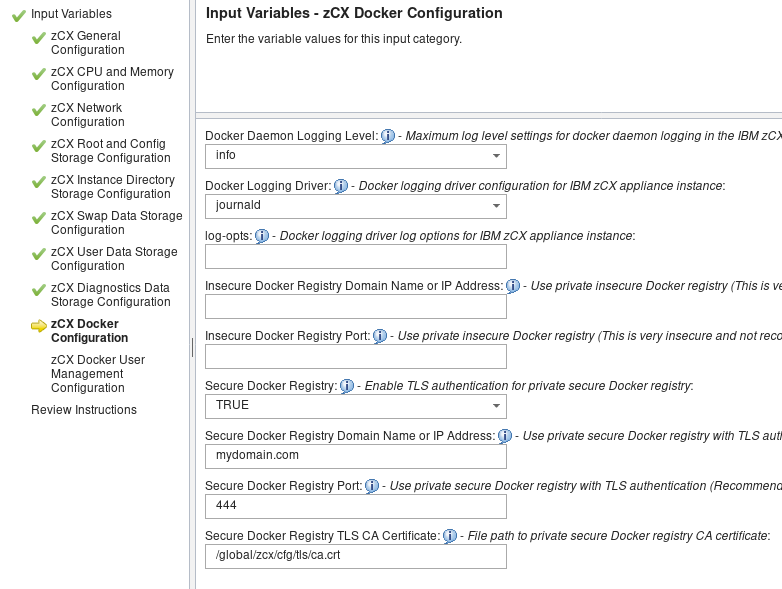

# What is a registry?
A registry is a location in which multiple image repositories can be stored and distributed from. Each image repository contains all of the different tagged images that have been uploaded, this allows for multiple image versions and architectures to be stored in the same place. Any of the images contained within a registry can be pulled to your local system and containers can then be started using that image.

## Dockerhub Registry
Dockerhub is a public registry that contains image repositories of many of the most popular applications. These include base-images for most linux "flavors" that are generally the foundation for all other docker images. Users may also push their own custom images to a repository hosted on Dockerhub as either public or private images. Access to private images may be managed directly in Dockerhub by setting up permissions for individual users or whole teams.

### Image Sources
As previously mentioned, Dockerhub can be used as a location for any user to store their own custom images. The benefit of this is that frequently you may be able to find an image that already contains the application(s) that you would like to deploy in your instance. The downside to such a low barrier-to-entry is that no guarentees are made about the content of a given image and it is usually very difficult to scrutinize the actual contents of a final image. For repositories which include the Dockerfile used to create the image it is possible to minimize some of the risks of using these community provided resources by examining the Dockerfile and building a copy of the image manually from the Dockerfile via the `docker build` command.

#### Official images and Publisher images
In addition to community provided images, Dockerhub hosts "official" and "publisher" image repositories that provide more curated solutions. Despite the fact that these types of images are usually better maintained and managed then other community images, that does **not** mean that these are "vetted"; vulnerabilities may still exist.
- **Official Images:** These are images that are provided directly by Dockerhub. These images are kept up to date by the Dockerhub team and are written in a way that exemplifies the current best practices in regards to Dockerfile creation. They publish a large portion of the base images and usually provide excellent documentation in regards to their use.
- **Publisher Images:** These images are provided and maintained by external vendors who work in tandem with Dockerhub to keep their image repository certified. Some of these images may require purchase or other license agreements.

## Private Registry
Although public registries like Dockerhub provide the ability to create and host a custom image repository, there are situations where it may be preferable for a user to host their own private registry. Some of these cases include:
- An image must contain proprietary code or resources
- zCX instances are "air-gapped" and cannot access the internet
- Finer control over image version deployment
- Separation of development/test images from production images


For users who already have a private registry hosted somewhere other then a zCX instance and are using a TLS CA that is not publicly verifiable please see [ Configuring your zCX instance](#configuring-your-zcx-instance) for instructions on how to setup zCX to access your private registry. For users not using TLS or who have a publicly verifiable CA, then no additional configuration should be needed.

### Building a private registry
For users who do not already have a private registry, it is possible to host your own registry on a zCX instance as a container running within your instance. The information provided below seeks to highlight the difference between running your private registry on zCX as opposed to "vanilla" docker and as such does not completely describe all of the options available for configuring your registry. For complete details on registry configuration please see [Docker: Deploy a registry server](https://docs.docker.com/registry/deploying/)

1. To begin, download or copy the Dockerfile provided in the following github repository into a new file called "Dockerfile":

 [Dockerfile for private registry on s390x](https://github.com/linux-on-ibm-z/dockerfile-examples/blob/master/DockerDistribution/Dockerfile)

 This Dockerfile contains the installation commands to create a Docker image that can be used to run a stand-alone private repository in a container.

2. To build the image issue the docker build command. This will result in a new docker image tagged "private-registry".

 `docker build . --tag private-registry`

3. By issuing the `docker images` command you should be able to verify that a new image named "private-registry" has been created.

####  Security
Before starting up your private registry you should should decide whether or not you want to enable security for the registry:

- Security is provided in the form of TLS authentication and transport. For those opting to use TLS it is also possible to set up user-level authentication to the registry, this is not possible when TLS is not enabled.

 In order to enable TLS authentication for a private registry a domain certificate and key must be provided to the registry container during startup that is signed by a certificate authority (CA). Depending on whether a public CA is used determines whether additional configuration will be required before a zCX instance can acces your registry:
 - **For users who have used a private CA or are on air-gapped systems that cannot verify a public CA:** The CA certificate will then need to be provided as part of zCX instance configuration through the zOSMF provisioning or reconfigure workflow.
 - **For users on non-air-gapped systems who have signed their domain key and certificate with a publicly verifiable CA:** As soon as the registry container is started it should be accessible to all zCX instances with network access.


- Although zCX allows for configuring access to an insecure registry it is strongly advised that using such a registry be restricted to performing isolated tests and that images containing sensitive or proprietary resources never be stored in a insecure registry.

For users who are interested in enabling user-level authentication for their private registry please see [Docker Registries: Restricting Access](https://docs.docker.com/registry/deploying/#restricting-access)


#### Starting your registry container
In order to start a registry container **without** security enabled use the `docker run` with the "private-registry" image that we previously built. The following command will start the registry container and will make it accessible via port 5000. The container will always restart if stopped and will automatically start when the zCX instance is started.

```
docker run -d \
  -p 5000:5000 \
  --restart=always \
  --name registry \
  private-registry
  ```
To start a registry with TLS enabled a domain certificate and key must be provided during container startup, this is possible in two different ways:

- **Provide the domain certificate and key as contents of a mounted *docker volume***

 First create a new *docker volume* to hold the TLS resources. Here we've named it "registry-certs" and it will use the default volume driver (*local*)that will store the contents locally.

 `docker volume create registry-certs`

 Now we will move the domain certificate and key to the newly created docker volume. We will need to first run a container with the volume

 We will then use `docker cp` command to copy over the files. In this case the files to copy are "domain.key" and "domain.crt". For this example we will use the busybox image because of its small size, but any base image could be used.

 ```
docker run -d -v registry-certs:/certs --name copy-certs-task busybox
docker cp domain.key copy-certs-task:/certs/
docker cp domain.crt copy-certs-task:/certs/
docker rm copy-certs-task
```
 Now that we have our TLS domain certificate and key in our volume we can now start our private registry. A description of each parameter is provided below.

 ```
docker run -d \
  --restart=always \
  --name registry \
  -v registry-certs:/certs \
  -e REGISTRY_HTTP_ADDR=0.0.0.0:443 \
  -e REGISTRY_HTTP_TLS_CERTIFICATE=/certs/domain.crt \
  -e REGISTRY_HTTP_TLS_KEY=/certs/domain.key \
  -p 444:443 \
  private-registry
  ```

| Parameter | Effect |
| ---| --- |
| -d | Detach the running container from the foreground, it will continue to run in the background.   |
| --restart=always | Always restart the container regardless of the exit status. This container will always be started when the zCX instance is started. |
| -v registry-certs:/certs | Mount the "registry-certs" *volume* to the "/certs" path in the running container |
| -e REGISTRY_HTTP_ADDR=0.0.0.0:443 | Set an environment variable that tells the registry to listen to all requests on port 443 inside the container |
| -e REGISTRY_HTTP_TLS_CERTIFICATE=/certs/domain.crt | Set an environment variable that indicates the path of the TLS domain certificate within the container, in this case it points to the location our volume is mounted to. |
| -e REGISTRY_HTTP_TLS_KEY=/certs/domain.key | Set an environment variable that indicates the path of the TLS domain key within the container, in this case it points to the location our volume is mounted to. |
| -p 444:443 | Map the external port 444 to the port 443 that is running inside of the container. It does not have to be port 444; any port that is not already assigned can be specified here. Note: zCX makes use of port 443 and as such cannot be used here. |

- **Provide the domain certificate and key as *docker secrets* and run the container as part of a service.** There are inherent benefits to running as part of a service, but the set up is slightly more complicated. For more information about running your private registry please see [Docker registries: Running as a service](https://docs.docker.com/registry/deploying/#run-the-registry-as-a-service)

## Configuring your zCX instance
**Note:** This step is only required when using a private registry with security enabled that has a CA certificate that cannot be publicly verified due to being issued from a private CA or because the system does not have network access to verify the CA certificate.

To configure your zCX instance to allow secure access to your private registry you must use either the provision (for new instances) or reconfigure (for existing instances) zOSMF workflow to specify the domain and port of the private registry as well as the CA certificate used to sign the domain key and certificate for the registry.

To begin, navigate to the "Gather IBM zCX appliance instance properties" step of the workflow and then navigate to the "zCX Docker Configuration" sub-step. Here you will see four fields that must be filled:



- *Secure Docker Registry:* Set this to true to enable TLS Security.
- *Secure Docker Registry Domain Name or IP Address:* Enter the domain name of your secure registry. We use "mydomain.com" here as an example.
- *Secure Docker Registry Port:* The port number of the private registry, in our previous example we used 444 and we will input that here.
- *Secure Docker Registry TLS CA Certificate:* The absolute path to the CA certificate on the **provisioning** system.

Once these values have been configured, continue as normal through the rest of the provision/reconfigure zOSMF workflow. Once the workflow is complete and you have started or restarted your zCX instance you should now be able to access your private registry.

## Interacting with the registry
With your registry now successfully running and your zCX instance configured to access your private registry, you can now test that it is functioning correctly by issuing `docker pull` and `docker push` commands.

```
# Pull the latest Ubuntu image from dockerhub
docker pull ubuntu
# Tag the Ubuntu image with the domain name and port of your registry
docker tag ubuntu mydomain.com:444/my-ubuntu
# Push the tagged Ubuntu image to your registry
docker push mydomain.com:444/my-ubuntu
```

For users who have also configured their registry to use user-authentication it may be necessary to perform a `docker login` before attempting to push or pull images.

`docker login mydomain.com:444`

For more information about each of these commands please see the official docker documentation:

- [Reference: docker login](https://docs.docker.com/engine/reference/commandline/login/)
- [Reference: docker push](https://docs.docker.com/engine/reference/commandline/push/)
- [Reference: docker pull](https://docs.docker.com/engine/reference/commandline/pull/)
- [Reference: docker tag](https://docs.docker.com/engine/reference/commandline/tag/)
